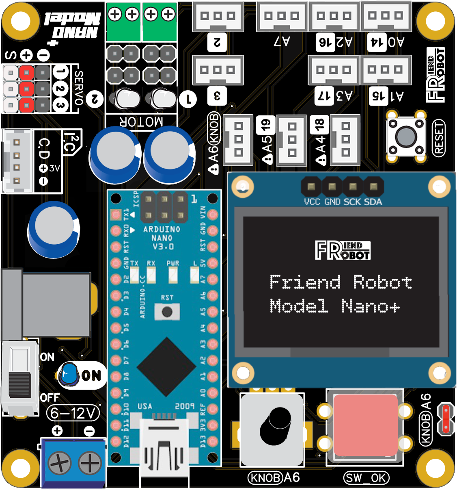
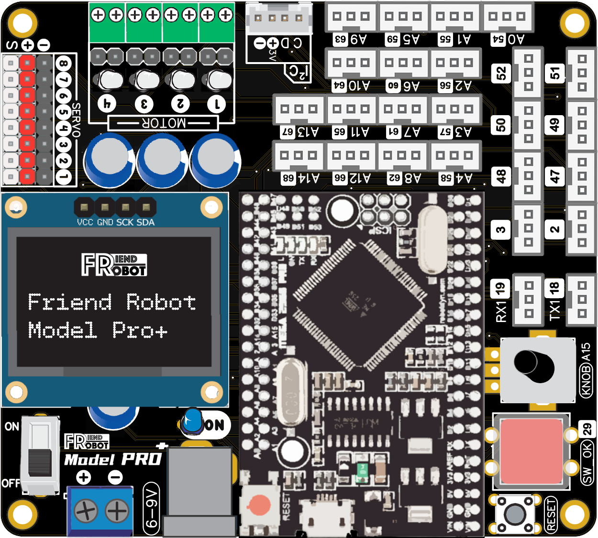

# FRIENDROBOT_LIBRARY
Friend Robot Avr ,Esp32 ,Hardware, Libralies Boards.

# สั่งซื้อบอร์ด Friend Robot ได้ที่
- สั่งซื้อบอร์ด : http://www.friendrobotshop.com/c/9
  
# วิธีเพิ่มบอร์ดและไลบารี่สำหรับ Arduino IDE
- https://www.friendrobot.co/pages/software-download

# วิธีใช้งานบอร์ด Friend Robot
- https://www.friendrobot.co/collections

# รองรับสำหรับสินค้า Friend Robot 

- Board Model Nano

 

- Board Model Nano Plus

 

- Board Model Pro

 

- Board Model Pro Pisu

 

- Board Model Hifi

 

# สอบถามเพิ่มเติม
- Facebook : https://www.facebook.com/friendrobot/
- Line : https://lin.ee/3bP2Ohi1V
- Phone : 096-2341492 (คุณเฟรน)

# Dev. By Friend Robot
- Friend_Anupong
- Boss.Dev

